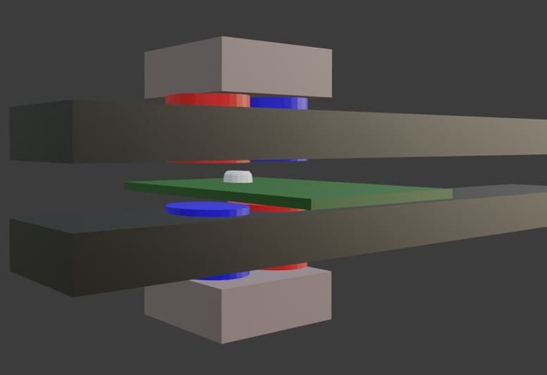

# Filament_thickness_detector

some simple methods to detect thickness using arduino-based hardware

## hall sensor + movable magnet 

key of success is maximisation of magnetic field change gradient. This setup have to be еру best with commonly available chinese magnets 

## video

### linear CCD sensors

use draft software Linear_CCD_TCD1201D.ino

and online viewer:

<https://pavel-b-kr12.github.io/serial_com_port_view_online/serial_com_port_view_online.htm>

properly setup diaphragm and optics is the key. Without appropriate optics you will have something like this:

### camera
LiveOV7670

